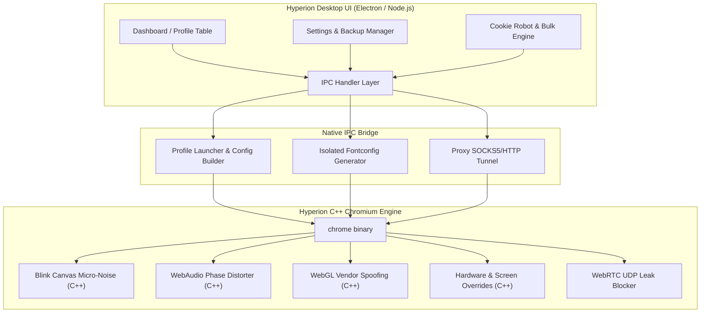

# 🌌 Hyperion Anti-Detect Multibrowser

<div align="center">


**Next-Generation Multi-Account Anti-Detect Browser with C++ Kernel-Level Fingerprint Modification**

[](https://github.com/Linchevatel/hyperion-browser/actions/workflows/build-and-release.yml)
[](https://github.com/Linchevatel/hyperion-browser/actions/workflows/chromium-upstream-watch.yml)
[](https://github.com/Linchevatel/hyperion-browser)
[](https://opensource.org/licenses/MIT)

</div>

---

## 📖 О проекте (Project Presentation)

**Hyperion** — это высокотехнологичный профессиональный мультибраузер для мультиаккаунтинга, арбитража трафика, крипто-активностей, электронной коммерции и защиты конфиденциальности.

Большинство существующих на рынке решений полагаются на внедрение JavaScript-скриптов (`preload.js`, расширения, переопределение геттеров через `Object.defineProperty` или `Proxy`). Такие решения тривиально детектируются современными антифрод-системами (Cloudflare Turnstile, DataDome, Pixelscan, CreepJS, Kasada) через глубокий анализ прототипов (`Function.prototype.toString`, утечки в WebGL конвейере, тайминги рендеринга).

**Hyperion решает эту проблему на фундаментальном уровне:**
Вся модификация аппаратных отпечатков внедрена **непосредственно в исходный C++ код ядра Chromium** (подсистемы Blink, WebAudio, WebGL, Content). Сайты и защитные скрипты взаимодействуют с нативным кодом браузера, что делает фингерпринт на 100% неотличимым от реального устройства.

---

## ⚡ Ключевые возможности

### 🛡️ 1. C++ Модификации ядра Chromium
- **Canvas 2D микро-шум**: Уникальный детерминированный алгоритм искажения субпикселей в `canvas_rendering_context_host.cc`, генерирующий индивидуальный хэш канваса под каждый профиль без визуальных артефактов.
- **WebAudio синтез**: Микро-сдвиги частот и фаз в буфере `offline_audio_destination_node.cc`.
- **Нативный WebGL спуфинг**: Подмена `UNMASKED_VENDOR_WEBGL` и `UNMASKED_RENDERER_WEBGL` на уровне C++ драйвера (NVIDIA RTX 4090, Apple M3, AMD Radeon и др.).
- **Аппаратные характеристики**: Полный нативный контроль над `navigator.hardwareConcurrency`, `navigator.deviceMemory`, `navigator.platform`, `screen.width/height`, `window.devicePixelRatio`.
- **Нулевая видимость автоматизации**: `navigator.webdriver` зафиксирован в значении `false` на уровне движка. Никаких флагов `--disable-blink-features` и всплывающих предупреждений от Chromium.

### 🔤 2. Изолированная шрифтовая подсистема (Zero-Footprint Fonts)
- В отличие от сторонних программ, требующих установки сотен шрифтов в саму систему (`/usr/share/fonts/`), Hyperion использует динамическую генерацию временной конфигурации **Fontconfig XML** для каждого запущенного профиля.
- В браузер изолированно передаются 30+ лицензионных шрифтов Windows/macOS (Arial, Times New Roman, Verdana, Georgia, Comic Sans, Trebuchet MS, Impact, Courier New и др.). Система пользователя остается абсолютно чистой.

### 🌐 3. WebRTC Zero-Leak & Прокси-инфраструктура
- **WebRTC Защита**: Блокировка утечек через немаршрутизируемые UDP-пакеты (`disable_non_proxied_udp`). Реальный IP пользователя никогда не передается через STUN/TURN серверы.
- **Поддержка любых прокси**: HTTP, HTTPS, SOCKS5 с поддержкой логина и пароля.
- **Смена IP мобильных прокси**: Поддержка Webhook URL ротации IP прямо из карточки профиля или таблицы.
- **Встроенный чекер**: Мгновенная проверка доступности прокси, пинга, геолокации и ISP.

### 🤖 4. Автономный Cookie Robot (Прогрев профилей)
- Фоновый серфинг по популярным трастовым сайтам в тихом режиме.
- Накопление естественной истории, кэша и First-Party Cookies с отображением прогресса в реальном времени.

### 🗂️ 5. Рабочие пространства и управление
- Организация профилей по папкам и тегам с мгновенной фильтрацией.
- Массовое создание десятков профилей в 1 клик с уникальными параметрами.
- Массовый запуск, остановка и удаление сессий.
- Портативный экспорт/импорт профилей в архив `.hyperion` со всеми куками, кэшем и отпечатками.
- Полное резервное копирование и восстановление всей базы (профили, прокси, папки, шаблоны).

---

## 🏗️ Архитектура системы



---

## 📦 Сборка и установка для Linux (Linux Build Guide)

### 1. Системные требования
- **ОС**: Любой современный дистрибутив Linux (Ubuntu 20.04+, Debian 11+, Fedora 38+, ALT Linux p10+, Arch Linux).
- **Node.js**: Версия 20.x или новее.
- **Python**: Версия 3.8+ (для вспомогательных скриптов).
- **Инструменты**: `git`, `curl`, `jq`, `rpm` (для сборки .rpm пакетов).

---

### 2. Быстрый запуск из исходного кода

1. **Клонируйте репозиторий:**
   ```bash
   git clone git@github.com:Linchevatel/hyperion-browser.git
   cd hyperion-browser
   ```

2. **Установите зависимости Node.js:**
   ```bash
   npm install
   ```

3. **Запустите клиент в режиме разработки:**
   ```bash
   ./hyperion-app
   # или
   npm start
   ```

---

### 3. Сборка пакетов установщиков (.AppImage, .deb, .rpm, .exe)

Hyperion использует `electron-builder` для автоматической кросс-платформенной упаковки:

```bash
# Сборка пакетов для Linux (.AppImage, .deb, .rpm):
npm run dist:linux

# Сборка пакетов для Windows (NSIS Installer .exe, Portable .exe):
npm run dist:win
```

Собранные пакеты будут помещены в директорию `dist/`:
- `dist/Hyperion-Browser-1.0.0.AppImage` (универсальный исполняемый файл)
- `dist/hyperion-browser_1.0.0_amd64.deb` (Debian/Ubuntu/Mint)
- `dist/hyperion-browser-1.0.0.x86_64.rpm` (Fedora/RHEL/CentOS/ALT)
- `dist/Hyperion-Setup-1.0.0.exe` (Windows Installer)

---

### 4. Сборка ядра Chromium с патчами Hyperion (C++ Core Compilation)

Если вы хотите самостоятельно пересобрать движок Chromium с нашими C++ патчами:

1. **Установите Chromium Depot Tools:**
   ```bash
   git clone https://chromium.googlesource.com/chromium/tools/depot_tools.git
   export PATH="$PWD/depot_tools:$PATH"
   ```

2. **Получите исходный код Chromium:**
   ```bash
   mkdir chromium && cd chromium
   fetch --nohooks chromium
   cd src
   ```

3. **Примените патч Hyperion Antidetect:**
   ```bash
   git apply /path/to/hyperion-browser/patches/hyperion_core_fingerprint.patch
   ```

4. **Сгенерируйте сборочную конфигурацию (Release):**
   ```bash
   gn gen out/Release --args="is_debug=false is_component_build=false symbol_level=0 is_official_build=true proprietary_codecs=true ffmpeg_branding=\"Chrome\" enable_nacl=false blink_symbol_level=0"
   ```

5. **Запустите компиляцию:**
   ```bash
   autoninja -C out/Release chrome
   ```

6. **Установите бинарник в домашнюю директорию Hyperion:**
   ```bash
   mkdir -p ~/hyperion-browser
   cp out/Release/chrome ~/hyperion-browser/
   cp out/Release/*.pak out/Release/*.bin out/Release/icudtl.dat ~/hyperion-browser/
   ```

Hyperion Desktop Client автоматически обнаружит бинарник по пути `~/hyperion-browser/chrome`!

---

## 🔄 Непрерывная интеграция и автообновления (CI/CD Workflows)

В репозиторий встроены два мощных автоматических пайплайна GitHub Actions:

1. **`build-and-release.yml`**  
   - Запускается при пуше любого тега версионирования (`git tag v1.0.0 && git push origin --tags`) либо вручную через `workflow_dispatch`.
   - В параллельных раннерах собирает:
     - **Linux**: `.AppImage`, `.deb`, `.rpm`.
     - **Windows**: `Hyperion-Setup-*.exe` и портативный `.exe`.
     - **Engine Patches**: тарболл патчей C++ и шрифтов `hyperion-browser-patches-and-fonts.tar.gz`.
   - Считает контрольные суммы SHA-256 (`SHA256SUMS.txt`).
   - Автоматически создает релиз на GitHub с прикреплением всех файлов.

2. **`chromium-upstream-watch.yml`**  
   - Каждую ночь по расписанию (`02:00 UTC`) опрашивает официальный API Google ChromiumDash.
   - При обнаружении нового стабильного релиза Chromium автоматически:
     1. Обновляет файл `CHROMIUM_VERSION`.
     2. Создает коммит и тег новой версии `v<CHROMIUM_VERSION>`.
     3. Запускает сборочный релиз-пайплайн.

---

## 📄 Лицензия

Проект распространяется под лицензией **MIT License**.  
Автор и архитектор проекта: **Linchevatel**.
