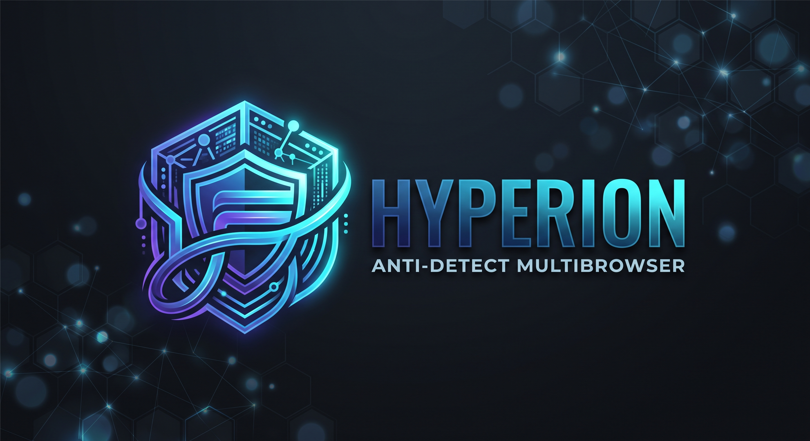
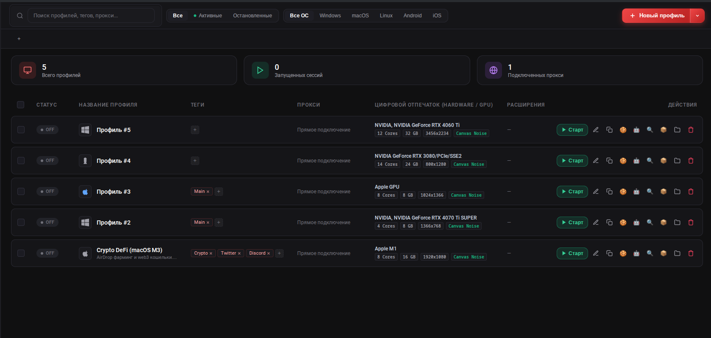
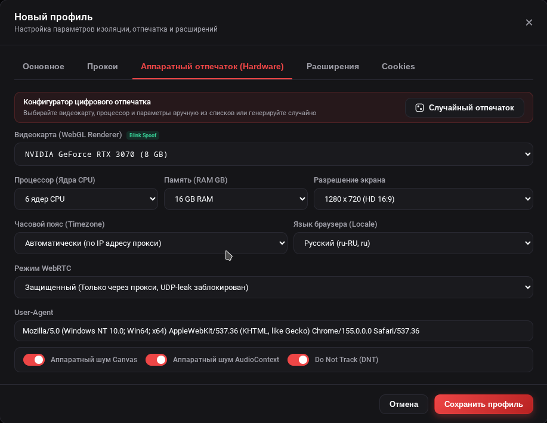
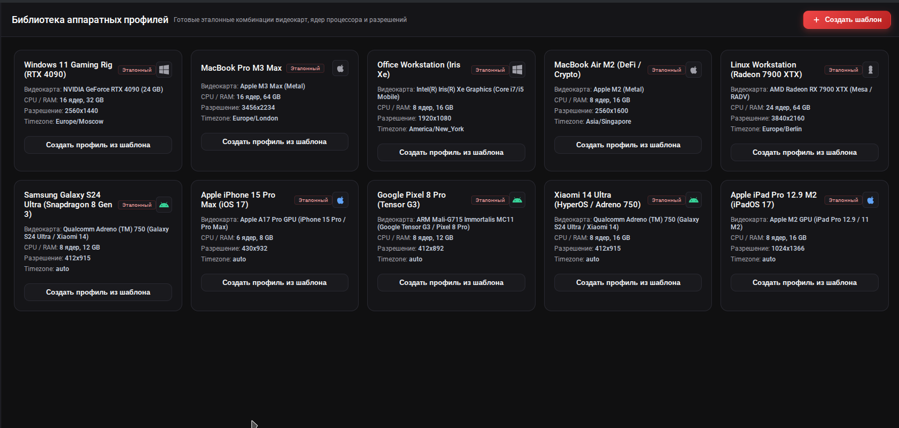
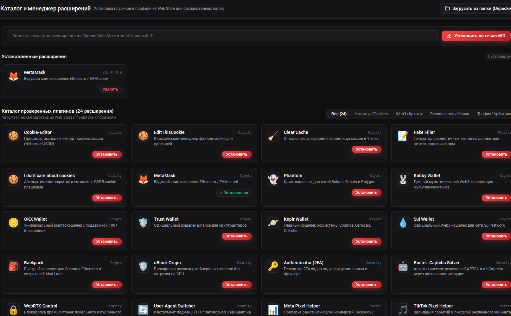

# 🌌 Hyperion Anti-Detect Multibrowser

<div align="center">



**Профессиональный мультибраузер нового поколения с глубокой модификацией цифровых отпечатков на уровне ядра Chromium**

[](https://github.com/Linchevatel/hyperion-browser)
[](https://opensource.org/licenses/MIT)

</div>

---

## 📖 О проекте и главное отличие от других мультибраузеров

**Hyperion** — это мультибраузер для безопасного управления множеством изолированных профилей. Он создан для задач арбитража трафика, мультиаккаунтинга, работы с крипто-проектами, электронной коммерции и сохранения настоящей приватности в сети.

### Чем Hyperion кардинально отличается от других решений на рынке:

1. **Защита на уровне C++ ядра, а не поверхностные JS-скрипты**  
   Большинство популярных антидетект-браузеров используют стандартный Chromium и пытаются подменять отпечатки «на лету» с помощью расширений или внедряемых пользовательских скриптов. Современные системы защиты сайтов (Cloudflare, DataDome, Pixelscan, CreepJS, Kasada) мгновенно распознают такие маскировки через анализ цепочек прототипов и скрытые нестыковки в JavaScript.  
   В Hyperion параметры отпечатков встроены **напрямую в скомпилированный код самого браузера**. Для сайтов и защитных систем браузер выглядит как совершенно обычный, оригинальный компьютер реального пользователя без признаков вмешательства.

2. **Максимальная скорость и легкость**  
   Отсутствие громоздких внешних надстроек и тяжелых инъекций делает каждый профиль быстрым и отзывчивым. Профили мгновенно запускаются, потребляют минимум оперативной памяти и работают стабильно даже при десятках одновременно открытых окон.

3. **Гарантированное отсутствие утечек**  
   В Hyperion встроена бескомпромиссная защита от утечек настоящего IP-адреса через WebRTC, полностью изолированные локальные хранилища и раздельные шрифтовые окружения для каждого профиля.

---

## 📸 Скриншоты интерфейса (Interface Preview)

<div align="center">

### Главная панель управления профилями
*Таблица профилей, папки, теги, статистика запущенных сессий и быстрые действия:*
<br/>


<br/><br/>

### Создание и детальная конфигурация профиля
*Выбор операционной системы, подключение прокси и импорт стартовых cookies:*
<br/>


<br/><br/>

### Тонкая настройка аппаратного отпечатка (Hardware & GPU)
*Нативный C++ микро-шум Canvas/Audio, спуфинг видеокарты, ядер процессора, RAM и защита WebRTC:*
<br/>


<br/><br/>

### Встроенный менеджер и каталог расширений
*Подключение расширений из Chrome Web Store и установка локальных расширений:*
<br/>


</div>

---

## ⚡ Возможности Hyperion

### 🛡️ Уникальные аппаратные отпечатки
Каждый профиль получает собственный сбалансированный цифровой отпечаток:
- **Canvas и WebAudio**: Индивидуальный детерминированный микро-шум холста и аудиосистемы, делающий отпечаток уникальным для каждой сессии, сохраняя картинку четкой и естественной.
- **Видеокарта и WebGL**: Реалистичная эмуляция видеокарт (NVIDIA GeForce, AMD Radeon, Apple Silicon) и их параметров.
- **Характеристики железа**: Независимая настройка количества ядер процессора, объема оперативной памяти, разрешения экрана, плотности пикселей и системной платформы.
- **Естественное поведение**: Отсутствие любых признаков автоматизации — сайты не видят автоматических тестовых окружений.

### 🔤 Изолированные наборы системных шрифтов
У каждого профиля создается собственная независимая библиотека шрифтов Windows и macOS (Arial, Times New Roman, Verdana, Georgia, Comic Sans, Trebuchet MS, Impact, Courier New и др.). Браузер использует их изолированно, не требуя установки сторонних шрифтов в основную операционную систему.

### 🌐 Сетевая безопасность и прокси
- **WebRTC Zero-Leak**: Принудительная блокировка передачи немаршрутизируемых пакетов. Ваш реальный провайдерский IP никогда не утечет мимо прокси через аудио/видео соединения.
- **Поддержка любых протоколов**: Быстрое подключение HTTP, HTTPS и SOCKS5 прокси с логином и паролем.
- **Встроенная диагностика**: Проверка статуса подключения, пинга, внешнего IP и страны прямо в таблице профилей.

### 🤖 Автономный робот прогрева (Cookie Robot)
Встроенный модуль фонового прогрева самостоятельно открывает популярные трастовые сайты в тихом режиме. Он естественным образом накапливает кэш, историю просмотров и cookies, благодаря чему новые профили сразу вызывают высокое доверие у защитных систем площадок.

### 🗂️ Удобное управление и массовые операции
- **Папки и теги**: Разделение аккаунтов по рабочим проектам, удобная цветовая маркировка и мгновенный поиск.
- **Массовое создание**: Генерация десятков готовых уникальных профилей с рандомизированными характеристиками в один клик.
- **Массовый запуск и остановка**: Быстрый старт выбранной группы аккаунтов.
- **Портативные профили `.hyperion`**: Экспорт любого профиля со всеми сохраненными куками, сессиями и настройками в единый файл для переноса на другой ПК или передачи коллеге.
- **Резервное копирование**: Создание и восстановление полной резервной копии базы данных всей программы.

---

## 📦 Сборка и запуск для Linux

### 1. Системные требования
- **ОС**: Современный дистрибутив Linux (Ubuntu 20.04+, Debian 11+, Fedora 38+, Arch Linux и др.).
- **Node.js**: Версия 20.x или новее.
- **Python**: Версия 3.8+ (для вспомогательных скриптов).
- **Инструменты**: `git`, `curl`, `jq`, `rpm` (для сборки rpm-пакетов).

---

### 2. Быстрый запуск из исходного кода

1. **Клонируйте репозиторий:**
   ```bash
   git clone git@github.com:Linchevatel/hyperion-browser.git
   cd hyperion-browser
   ```

2. **Установите зависимости:**
   ```bash
   npm install
   ```

3. **Запустите программу:**
   ```bash
   ./hyperion-app
   # или
   npm start
   ```

---

### 3. Сборка готовых пакетов установщиков (.AppImage, .deb, .rpm, .exe)

Для сборки установщиков используется настроенный модуль автоматической упаковки:

```bash
# Сборка пакетов для Linux (.AppImage, .deb, .rpm):
npm run dist:linux

# Сборка пакетов для Windows (инсталлятор .exe и портативная версия):
npm run dist:win
```

Готовые файлы появятся в папке `dist/`:
- `dist/Hyperion-Browser-1.0.0.AppImage` (универсальный запуск без установки)
- `dist/hyperion-browser_1.0.0_amd64.deb` (для Debian, Ubuntu, Linux Mint)
- `dist/hyperion-browser-1.0.0.x86_64.rpm` (для Fedora, RHEL, CentOS)
- `dist/Hyperion-Setup-1.0.0.exe` (установщик для Windows)

---

### 4. Самостоятельная сборка модифицированного C++ ядра Chromium

Если вы хотите собрать ядро Chromium с нашими C++ патчами вручную:

1. **Установите Chromium Depot Tools:**
   ```bash
   git clone https://chromium.googlesource.com/chromium/tools/depot_tools.git
   export PATH="$PWD/depot_tools:$PATH"
   ```

2. **Загрузите исходный код Chromium:**
   ```bash
   mkdir chromium && cd chromium
   fetch --nohooks chromium
   cd src
   ```

3. **Примените патч Hyperion:**
   ```bash
   git apply /path/to/hyperion-browser/patches/hyperion_core_fingerprint.patch
   ```

4. **Сгенерируйте конфигурацию компиляции (Release):**
   ```bash
   gn gen out/Release --args="is_debug=false is_component_build=false symbol_level=0 is_official_build=true proprietary_codecs=true ffmpeg_branding=\"Chrome\" enable_nacl=false blink_symbol_level=0"
   ```

5. **Запустите сборку:**
   ```bash
   autoninja -C out/Release chrome
   ```

6. **Поместите готовый бинарник в рабочую папку Hyperion:**
   ```bash
   mkdir -p ~/hyperion-browser
   cp out/Release/chrome ~/hyperion-browser/
   cp out/Release/*.pak out/Release/*.bin out/Release/icudtl.dat ~/hyperion-browser/
   ```

Клиент Hyperion автоматически найдет и подключит ядро по пути `~/hyperion-browser/chrome`.

---

## ☕ Поддержка проекта (Support the project)

Если вы хотите поддержать развитие и сопровождение проекта Hyperion:

| Валюта | Сеть (Network) | Адрес (Address) |
| :---: | :--- | :--- |
|  **BTC** | Bitcoin | `bc1q0u4pwuqxg7kt5y4p84lc8zzcawhzr3auzw005z` |
|  **ETH** | Ethereum | `0xD3002c0967a8D28FDF67c2Df8488006e965B9a6A` |
|  **USDT** | TRON (TRC-20) | `TYUkmupkzCGzkio77Db7PKEDu4JN8JD1eb` |
|  **TRX** | TRON | `TX7yRGo5xT2Mj5NBVhu7bdv58jmStHFuGZ` |

---

## 📄 Лицензия

Проект распространяется под лицензией **MIT License**.  
Автор и создатель проекта: **Linchevatel**.
