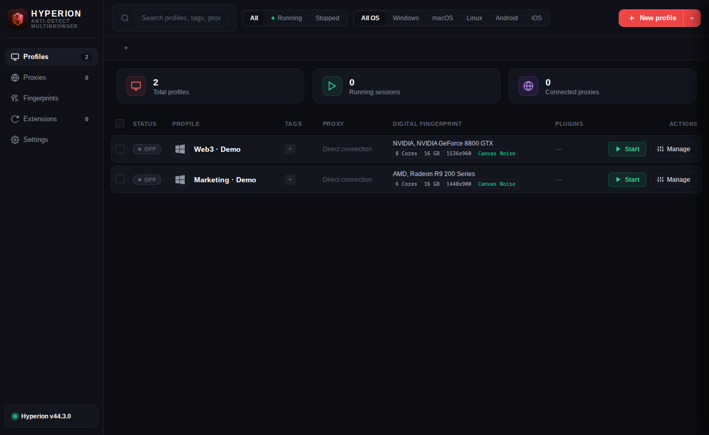
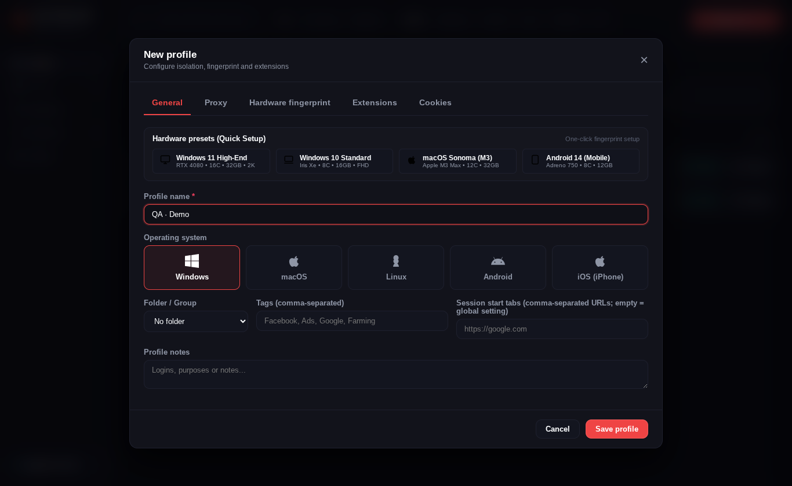
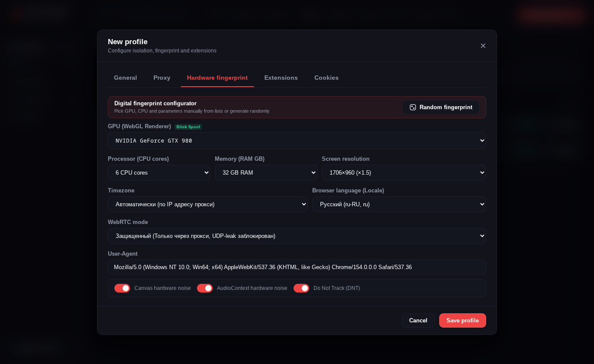
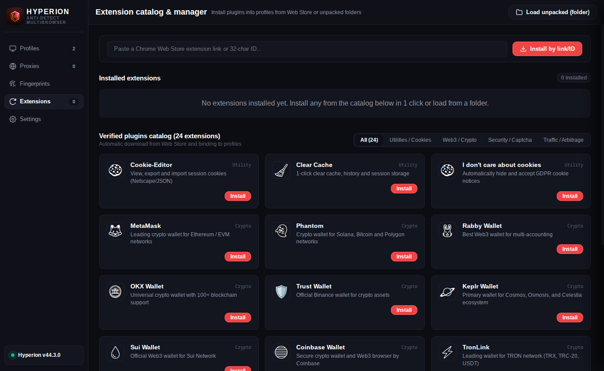

# 🌌 Hyperion Anti-Detect Multibrowser

**🇷🇺 [Читать на русском](README.ru.md)**

<div align="center">


**Next-generation professional anti-detect multibrowser with deep Chromium kernel-level browser fingerprint modification**

[](https://github.com/Linchevatel/hyperion-browser)
[](https://opensource.org/licenses/MIT)

</div>

---

## 📖 About the Project & Key Differentiators

**Hyperion** is an anti-detect multibrowser designed for secure multi-accounting and isolated profile management. Built specifically for affiliate marketing, traffic arbitrage, crypto projects and airdrops, e-commerce, and uncompromising online privacy.

### What Sets Hyperion Apart from Other Solutions:

1. **Chromium C++ Kernel-Level Protection vs. Surface JS Injections**

   <div align="center">
   
   </div>

   Most popular anti-detect browsers rely on vanilla Chromium builds and attempt on-the-fly fingerprint spoofing using browser extensions or injected user scripts. Modern anti-fraud and bot detection systems (Cloudflare, DataDome, Pixelscan, CreepJS, Kasada) immediately detect such masking via JavaScript prototype chain analysis, property descriptor anomalies, and timing inconsistencies.  
   In Hyperion, fingerprint parameters are baked **directly into the compiled C++ engine of the browser**. To websites and anti-fraud engines, Hyperion appears as a genuine, untampered machine used by a real human, with zero traces of emulation or automation.

2. **Maximum Speed & Minimal Resource Footprint**  
   Without cumbersome extensions or heavy JS injection overhead, every profile remains lightning-fast and responsive. Profiles launch instantly, consume minimal RAM, and maintain rock-solid stability even with dozens of active concurrent windows.

3. **Guaranteed Zero Leaks**  
   Hyperion provides uncompromising protection against real IP leaks via WebRTC, completely isolated local storage, and separated font environments for every profile.

---

## ⚡ Features

### 🛡️ Unique Hardware Fingerprints

<div align="center">

</div>

Each profile receives its own consistent and balanced browser fingerprint:
- **Canvas & WebAudio**: Deterministic per-session canvas noise and audio buffer randomization that produces a unique fingerprint while keeping rendered graphics visually sharp and natural.
- **GPU & WebGL Spoofing**: Authentic emulation of GPU vendor/renderer strings (NVIDIA GeForce, AMD Radeon, Apple Silicon) and low-level WebGL parameters.
- **Hardware Concurrency & Specs**: Independent configuration of CPU cores (hardware concurrency), device memory (RAM), screen resolution, device pixel ratio (DPR), and operating system platform.
- **Human-Like Behavior**: Complete absence of automation flags (e.g. `navigator.webdriver`) — websites detect no test environments or bot frameworks.

### 🔤 Isolated System Font Packs
Each profile has its own independent font bundle mimicking authentic Windows and macOS environments (Arial, Times New Roman, Verdana, Georgia, Comic Sans, Trebuchet MS, Impact, Courier New, etc.). The browser exposes them in complete isolation without requiring any third-party fonts to be installed on your host OS.

### 🌐 Network Security & Proxies

<div align="center">

</div>

- **WebRTC Zero-Leak**: Enforced filtering and blocking of non-proxied candidate addresses. Your real ISP IP address will never leak past the proxy during audio/video WebRTC handshakes.
- **Universal Protocol Support**: Seamless integration with HTTP, HTTPS, and SOCKS5 proxies, including username/password authentication.
- **Built-in Diagnostics**: Live checking of connection status, latency/ping, external IP, and geolocation directly in the profile table.

### 🤖 Autonomous Profile Warm-Up (Cookie Robot)

<div align="center">

</div>

The built-in headless warm-up module autonomously browses curated lists of popular, high-authority websites in the background. It organically accumulates browser cache, history, and cookies, establishing high initial trust scores with anti-fraud systems for newly created profiles.

### 🗂️ Profile Management & Bulk Operations

<div align="center">

</div>

- **Folders & Tags**: Group profiles by campaign or client, assign color tags, and find accounts instantly with fast filtering.
- **Bulk Profile Creation**: One-click generation of dozens of unique profiles with randomized, mathematically consistent fingerprint attributes.
- **Batch Launch & Termination**: Rapidly launch or terminate selected batches of browser profiles.
- **Portable `.hyperion` Profiles**: Export any profile with all cookies, session storage, and settings intact into a single portable file for team sharing or migration between machines.
- **Database Backup & Restore**: Full application database snapshot and recovery at any time.

---

## 📸 Screenshots (Interface Preview)

<div align="center">

### Main Profile Dashboard
*Profile table, folders, tags, active session monitoring, and quick actions:*
<br/>


<br/><br/>

### Profile Creation & Detailed Configuration
*OS selection, proxy configuration, user-agent settings, and initial cookie import:*
<br/>


<br/><br/>

### Hardware & GPU Fingerprint Fine-Tuning
*Native C++ Canvas/Audio noise, GPU vendor/renderer spoofing, CPU cores, RAM, and WebRTC leak protection:*
<br/>


<br/><br/>

### Built-in Extension Manager & Catalog
*Installing extensions directly from the Chrome Web Store or loading unpacked local extensions:*
<br/>


</div>

---

## 📦 Build & Run for Linux

### 1. System Requirements
- **OS**: Modern Linux distribution (Ubuntu 20.04+, Debian 11+, Fedora 38+, Arch Linux, etc.).
- **Node.js**: Version 20.x or newer.
- **Python**: Version 3.8+ (for auxiliary build scripts).
- **Tools**: `git`, `curl`, `jq`, `rpm` (required for building rpm packages).

---

### 2. Quick Start from Source

1. **Clone the repository:**
   ```bash
   git clone git@github.com:Linchevatel/hyperion-browser.git
   cd hyperion-browser
   ```

2. **Install dependencies:**
   ```bash
   npm install
   ```

3. **Run the application:**
   ```bash
   ./hyperion-app
   # or
   npm start
   ```

---

### 3. Building Distribution Packages (.AppImage, .deb, .rpm, .exe)

An automated packaging pipeline is preconfigured to build native installers:

```bash
# Build Linux packages (.AppImage, .deb, .rpm):
npm run dist:linux

# Build Windows packages (.exe installer and portable edition):
npm run dist:win
```

Built packages will be available in the `dist/` directory:
- `dist/Hyperion-Browser-1.0.0.AppImage` (portable standalone executable, no installation needed)
- `dist/hyperion-browser_1.0.0_amd64.deb` (for Debian, Ubuntu, Linux Mint)
- `dist/hyperion-browser-1.0.0.x86_64.rpm` (for Fedora, RHEL, CentOS)
- `dist/Hyperion-Setup-1.0.0.exe` (Windows installer)

---

### 4. Compiling Modified Chromium C++ Kernel from Source

If you want to manually compile the Chromium kernel with our C++ anti-detect patches:

1. **Install Chromium Depot Tools:**
   ```bash
   git clone https://chromium.googlesource.com/chromium/tools/depot_tools.git
   export PATH="$PWD/depot_tools:$PATH"
   ```

2. **Fetch Chromium source code:**
   ```bash
   mkdir chromium && cd chromium
   fetch --nohooks chromium
   cd src
   ```

3. **Apply the Hyperion patch:**
   ```bash
   git apply /path/to/hyperion-browser/patches/hyperion_core_fingerprint.patch
   ```

4. **Generate compilation config (Release):**
   ```bash
   gn gen out/Release --args="is_debug=false is_component_build=false symbol_level=0 is_official_build=true proprietary_codecs=true ffmpeg_branding=\"Chrome\" enable_nacl=false blink_symbol_level=0"
   ```

5. **Start the build:**
   ```bash
   autoninja -C out/Release chrome
   ```

6. **Copy the compiled binaries into the Hyperion working directory:**
   ```bash
   mkdir -p ~/hyperion-browser
   cp out/Release/chrome ~/hyperion-browser/
   cp out/Release/*.pak out/Release/*.bin out/Release/icudtl.dat ~/hyperion-browser/
   ```

The Hyperion client will automatically discover and load the custom engine at `~/hyperion-browser/chrome`.

---

## ☕ Support the Project

If you would like to support the ongoing development and maintenance of Hyperion:

| Asset | Network | Address |
| :---: | :--- | :--- |
|  **BTC** | Bitcoin | `bc1q0u4pwuqxg7kt5y4p84lc8zzcawhzr3auzw005z` |
|  **ETH** | Ethereum | `0xD3002c0967a8D28FDF67c2Df8488006e965B9a6A` |
|  **USDT** | TRON (TRC-20) | `TYUkmupkzCGzkio77Db7PKEDu4JN8JD1eb` |
|  **TRX** | TRON | `TX7yRGo5xT2Mj5NBVhu7bdv58jmStHFuGZ` |

---

## 📄 License

This project is licensed under the **MIT License**.  
Author & Creator: **Linchevatel**.
