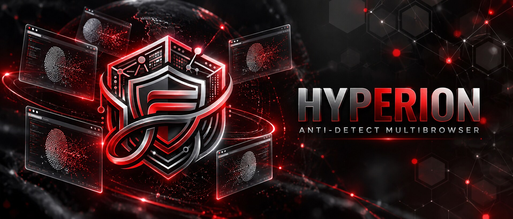
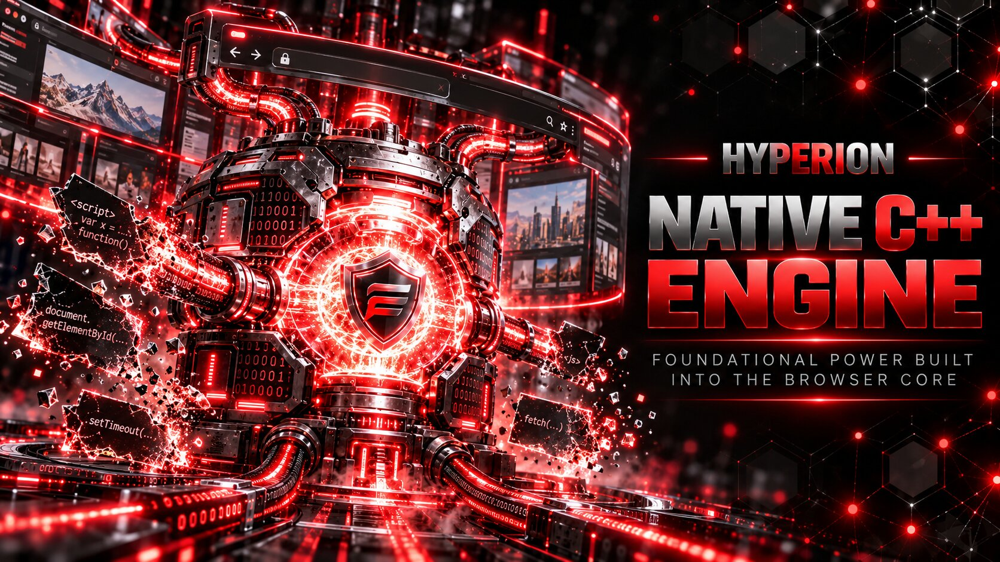
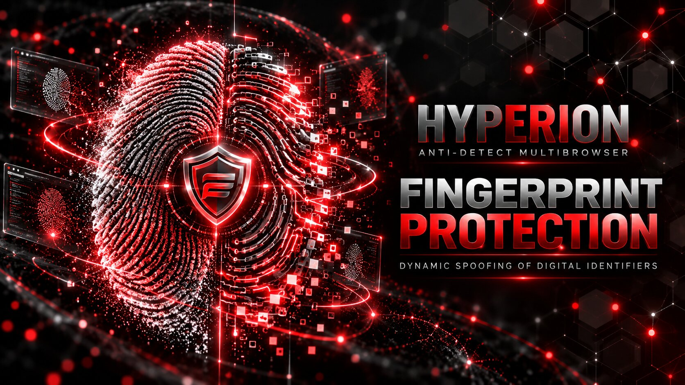
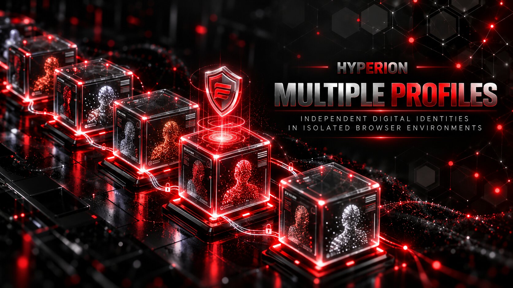
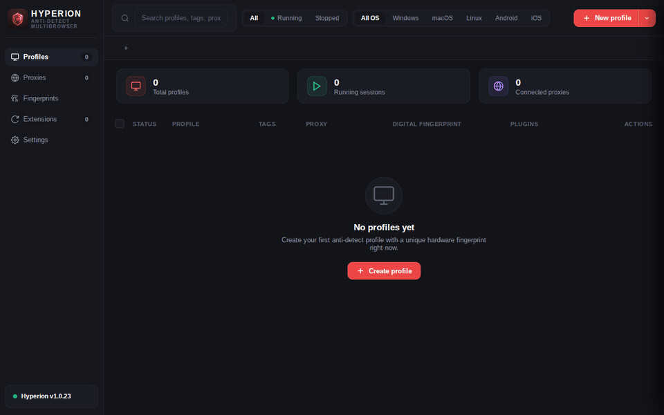
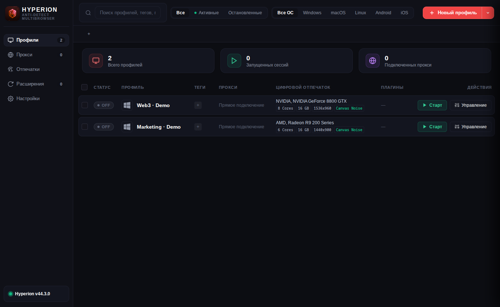
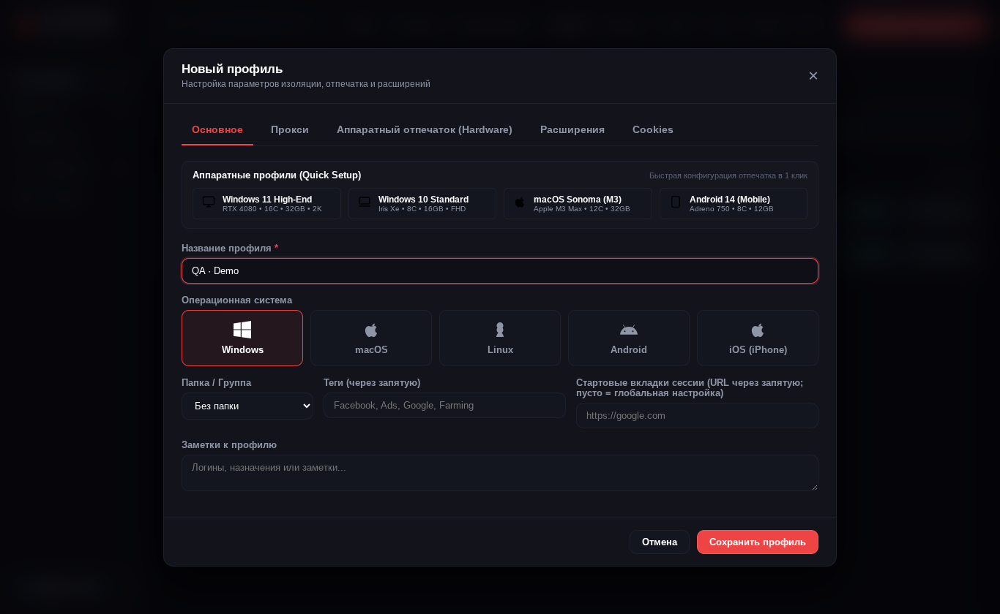
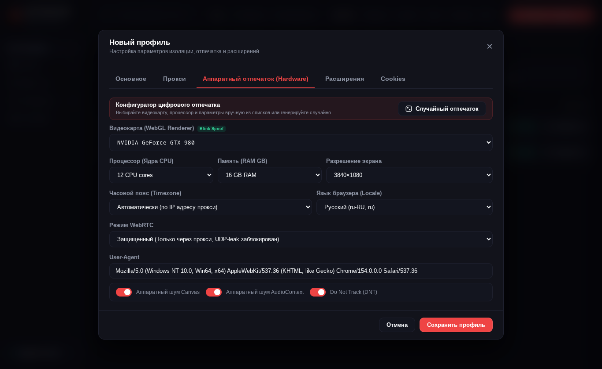
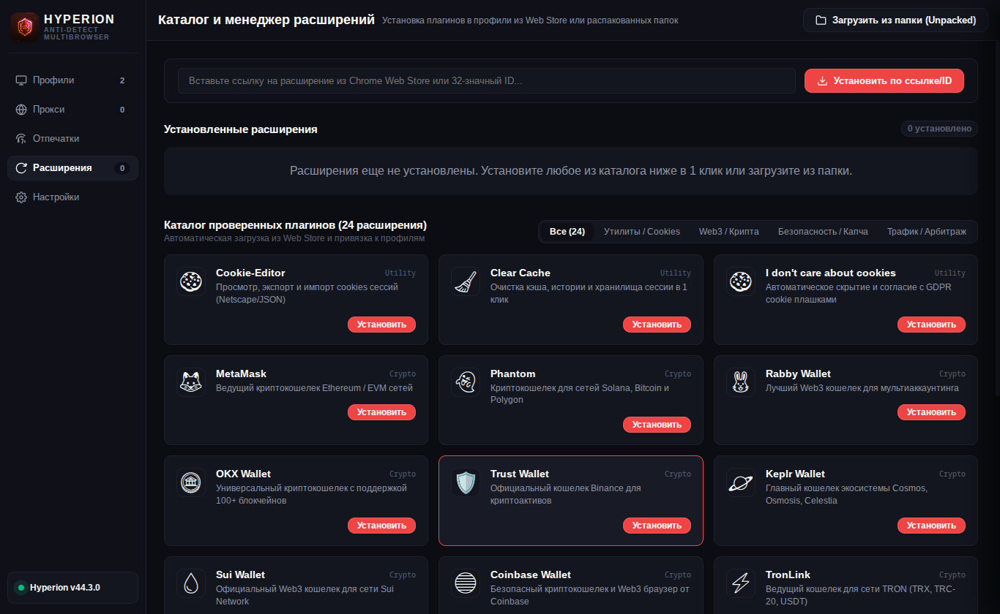

# 🌌 Hyperion Browser

**🇬🇧 [Read in English](README.md)**

**Открытый менеджер браузерных профилей с модифицированным Chromium, прокси и настройками отпечатка**

[Скачать релизы](https://github.com/Linchevatel/hyperion-browser/releases) · [Быстрый старт и сборка](docs/QUICKSTART.ru.md) · [FAQ](docs/FAQ.ru.md) · [Безопасность](SECURITY.ru.md)

## О проекте

Hyperion — настольное приложение на Electron для управления отдельными профилями Chromium. Оно предлагает настройку прокси и цифрового отпечатка, а также исходные патчи модифицированного движка Chromium. Подходит для тестирования и разделения контекстов работы в браузере; используйте его только при наличии разрешения и соблюдайте правила сайтов.

### Для кого?

- **QA-инженеры и веб-разработчики:** повторение тестов с отдельными cookies, расширениями, прокси и настраиваемыми свойствами браузера.
- **Арбитраж трафика и маркетинг:** отдельные рабочие профили для рекламных проектов, клиентских кабинетов и проверки лендингов.
- **Мультиаккаунтинг:** управление несколькими разрешёнными аккаунтами с отдельными cookies, расширениями и настройками прокси.
- **Криптовалюты и Web3:** отдельные профили для dApps, тестовых сетей и проектов с кошельками-расширениями. Кошельки подключаются через браузерные расширения.
- **Агентства и e-commerce:** разделение браузерных сессий для магазинов, клиентских проектов и рабочих аккаунтов.
- **Пользователи с разными рабочими контекстами:** организация сессий по проектам без смешивания данных браузера.
- **Исследователи браузеров:** изучение реализации и воспроизведение проверок опубликованных патчей Chromium.

### Чем полезен Hyperion?

Исходники менеджера профилей и патчи Chromium доступны для изучения. Профили, прокси, расширения и настройки отпечатка собраны в одном настольном интерфейсе на русском и английском. Согласованные аппаратные пресеты дают начальную конфигурацию без ручного заполнения каждого поля.

## Скачивание и первый запуск

1. Откройте [GitHub Releases](https://github.com/Linchevatel/hyperion-browser/releases) и выберите доступный файл для своей ОС/архитектуры: Linux AppImage, `.deb`, `.rpm` или Windows установщик/портативный `.exe`. Набор файлов зависит от релиза; пакеты macOS не входят в текущий процесс выпуска.
2. Установите или запустите приложение от обычного пользователя. Для Linux AppImage сначала разрешите исполнение файла. Команды и решение типовых проблем — в [инструкции](docs/QUICKSTART.ru.md).
3. В настройках проверьте путь к исполняемому файлу браузера. Создайте пробный профиль, при необходимости настройте прокси и запустите его. Проверьте видимый IP и настройки до работы с важными аккаунтами.

## Возможности и границы

### Модифицированный Chromium и настройки отпечатка

**Hyperion подменяет параметры цифрового отпечатка браузера в соответствии с настройками профиля: User-Agent, платформу, число ядер, память, экран и поддерживаемые параметры Canvas, Audio и WebGL. Подмена выполняется модифицированным Chromium Hyperion.**

- Настройки User-Agent, платформы, числа ядер CPU, сообщаемой памяти, размеров экрана, шума Canvas/Audio и строк производителя/рендерера WebGL.
- Патчи Chromium на C++ реализуют отдельные подмены; отдельный патч WebGL-пресетов обрабатывает выбранные параметры, фильтрацию расширений и точность шейдеров. Параметры задаются для каждого профиля.
- Вспомогательное расширение дополняет настройки медиа, голосов и авторизации прокси.
- В Linux конфигурация fontconfig подключает комплектные шрифты для браузерных профилей.

Профили Windows, macOS и мобильных платформ предоставляют начальные настройки отпечатка для дальнейшей персонализации.

### Прокси и сетевые настройки

Реализованы настройки HTTP, HTTPS и SOCKS5 прокси, вспомогательная авторизация, проверка IP/геолокации и запросы по заданному Change-IP URL. Для SOCKS5 с авторизацией используется локальный HTTP-to-SOCKS мост. При запуске применяются политики WebRTC для ограничения UDP вне прокси. Можно подключить собственный прокси или прокси выбранного провайдера.

### Прогрев cookies

Встроенный инструмент посещает выбранные сайты в headless Chromium с каталогом профиля, чтобы накопить cookies и данные сайтов. Подходит для подготовки тестовых сессий и автоматизации повторяющихся посещений.

### Управление профилями

- Отдельные каталоги данных браузера, папки/теги, клонирование, шаблоны и массовое создание/запуск/остановка/удаление.
- Импорт/экспорт cookies, установка расширений из Chrome Web Store или локальных папок и предпросмотр конфигурации отпечатка.
- Экспорт `.hyperion` содержит конфигурацию профиля и cookies, которые смог выгрузить скрипт, **но не всю историю, кэш, local storage или session storage**.
- Резервная копия JSON содержит настройки и метаданные менеджера, **а не полную копию каталогов браузерных профилей**.

## Документация

[Быстрый старт](docs/QUICKSTART.ru.md) · [FAQ](docs/FAQ.ru.md) · [Политика безопасности](SECURITY.ru.md)

Есть вопрос или нашли ошибку? Используйте [формы issues](https://github.com/Linchevatel/hyperion-browser/issues/new/choose).

---

## 🎬 Демонстрация интерфейса

## 📸 Скриншоты интерфейса (Interface Preview)

### Главная панель управления профилями
*Таблица профилей, папки, теги, статистика запущенных сессий и быстрые действия:*
 

  

### Создание и детальная конфигурация профиля
*Выбор операционной системы, подключение прокси и импорт стартовых cookies:*
 

  

### Тонкая настройка аппаратного отпечатка (Hardware & GPU)
*Настройки Canvas/Audio, WebGL, CPU, памяти и WebRTC (поведение зависит от движка):*
 

  

### Встроенный менеджер и каталог расширений
*Подключение расширений из Chrome Web Store и установка локальных расширений:*
 

---

## ☕ Поддержка проекта (Support the project)

Если вы хотите поддержать развитие и сопровождение проекта Hyperion:

| Валюта | Сеть (Network) | Адрес (Address) |
| :---: | :--- | :--- |
|  **BTC** | Bitcoin | `bc1q0u4pwuqxg7kt5y4p84lc8zzcawhzr3auzw005z` |
|  **ETH** | Ethereum | `0xD3002c0967a8D28FDF67c2Df8488006e965B9a6A` |
|  **USDT** | TRON (TRC-20) | `TYUkmupkzCGzkio77Db7PKEDu4JN8JD1eb` |
|  **TRX** | TRON | `TX7yRGo5xT2Mj5NBVhu7bdv58jmStHFuGZ` |

---

## 📄 Лицензия

Приложение Hyperion распространяется под лицензией **MIT License**. Chromium и комплектные сторонние компоненты сохраняют собственные лицензии; MIT не заменяет их условия.

Автор и создатель проекта: **Linchevatel**.
